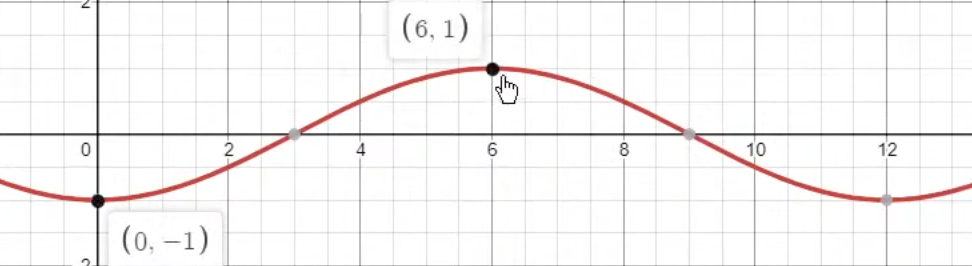

# Preface

This file is to save my notes/ideas while learning and exploring. 

# Body

**Change the directory of Jupyter Notebook**

```{python}
jupyter notebook --notebook-dir C:/users/lincoln
```

**delete objects**

`del` 


- Cleaning
- Feature engineering
- Feature transformations
- Feature selection
- Encoding
- Scaling
- Target transformation
- Model selection
- Hyperparameter optimization
- Ensembling


`train.isna().sum()`

`pd.concat([table1, table2], axis = 0)`

`table.select_dtypes(np.number)`

`data1 = data.copy()`

`np.log1p()`: log(x+1)

log transformation: skewed data

sin()/cos() transformation: for months, cause months are like a cycle, that is, Dec (12) should be next to Jan (1), otherwise models will think 12 (Dec) is greater than 1 (Jan)




